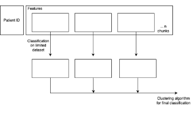
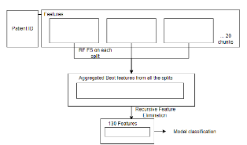
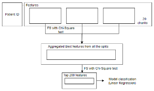
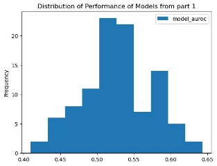

Predicting Alzheimer’s Using A Genetics Dataset and Machine Learning Approaches With Big Data Methodologies

Mustafa Mehmood England  Nottingham

[hcymm3@nottingham.ac.uk ](mailto:hcymm3@nottingham.ac.uk) 
***Abstract*— Alzheimer’s disease is one of the most common causes  of  Dementia.  It  is  an  uncurable  neurodegenerative disease where early detection is important in order for it to be dealt  with.  This  research  paper  focuses  on  using  genetic information from a large dataset of 534 patients and 297684 categories of corresponding genetics data to predict which genes may correlate with patients that are diagnosed with Alzheimer’s.  There are two main  frameworks applied which use different methods in order to make their prediction. One involving splitting the data into chunks and classifying each chunk seperately, which results in a lack of interpretability but higher accuracy. The second revolves around recursive feature  selection  and  dimensionality  reduction  and classification,  although  this  resutls  in  lower  accuracy  the results  are  much  more  interpretable.  There  are  also  two implementations of the second framework, one using random forest  while  the  second  uses  chi-squared  testing  to  select features.**  

**Keywords—: Alzheimer’s Disease, Genetic prediction, ML, Random Forest** 

1. INTRODUCTION AND BACKGROUND

Alzheimer’s disease (AD) represents one of the most pressing challenges in modern healthcare while also being a leading cause for dementia. AD affects the brain by initially leading to subtle and  often  overlooked  memory  impairments  which  gradually progresses into severe cognitive deficits. The early stage often referred to as mild cognitive impairment (MCI), slowly develops into full blown dementia [1]. It also accounts for most cases of dementia that are diagnosed after the age of 60. There are some treatments  which  provide  relief  from  the  symptoms,  but  no complete  cure  is  currently  available  [2].  The  incidence  and prevalence  of  AD  has  increased  by  147.95%  and  160.84% respectively from 1990 to 2019 [3]. By the year 2040, the number of people affected by dementia worldwide is expected to reach 81.1 million as stated by Chu et al. [4] who also talks about how early diagnosis allows for timely intervention potentially delaying the progression and potentially preserving cognitive functioning of  brain  through  pharmacological  and  non-pharmacological treatments. 

Zhang  et  al.  [5]  discusses  how  applying  machine  learning techniques to the field of medicine has contributed to significant enhancement of accuracy and efficiency of disease predictions. They  highlight  several  models  like  support  vector  machines 

(SVMs) and neural networks which have been effectively utilized in disease prediction. This just shows the transformative impact of ML in medical diagnostics and patient care in general. 

Zhang  et  al.  [6]  explores  the  significant  role  that  big  data methodologies play in AD research. The authors of this paper have systematically reviewed 38 papers over a five-year period focusing on various aspects of AD research such as diagnosis, prediction, and patient care facilitated by big data methodologies. Their review focuses more on using logistic regression and SVMs, but the emphasis lied in realising the potential of big data in AD research by enhancing diagnostics and with the use of machine learning techniques, effectively predicting the early onset of AD. 

Kavitha et al. [7] discusses the results of using several machine learning  models  like  decision  trees  (DT),  Support  Vector Machines  (SVMs),  random  forest  (RF)  and  Extreme  Gradiant Boosting (XGB) in the prediction of Alzheimer’s disease. These models scored an average of 83% validation accuracy. This just shows the superior performance of machine learning models when employed in the field of medicine especially disease prediction. 

A study by Musto et al. [8] investigates the efficacy of machine learning techniques for predicting AD. The dataset used here is from  an  Alzheimer's  Disease  Neuroimaging  Initiative  (ADNI) cohort.  The  authors  highlight  the  limitations  of  traditional machine learning and advantages of survival machine learning, which considers time-dependent variables and censored data to predict the time of onset and the likelihood of AD. They yielded an  impressive  predictive  C-index  of  0.86,  demonstrating  the potential  of  this  approach.  This  study  makes  it  clear  that integrating  advanced  machine  learning  techniques  in  clinical research and prediction of such diseases is absolutely viable. 

Khalila  et  al.  [9]  explores  the  utilization  of  RF  algorithm  to address  the  challenge  of  disease  risk  prediction  from  highly imbalanced data. This paper used data from the National Inpatient Sample of Healthcare Cost and Utilization Project. The authors employed an ensemble learning approach which combined sub- sampling with the help of RF to predict risks of eight chronic diseases.  This  was  compared  against  SVMs,  bagging,  and boosting. The RF ensemble outperformed other models with an average area under curve (AUC) of 88.79%. This study focused on demonstrating the effectiveness of RF in handling imbalanced datasets. 

In a study conducted by Lebedeva et al. [10], the development and validation  of  Random  Forest  classifiers  has  been  discussed. Primarily focusing on structural MRI data, this study found that RF classifiers were robust across the datasets notably ADNI and AddNeuroMed. It also addresses the classifier’s ability to handle variations  in  MRI  protocols  across  several  other  cohorts, suggesting that RF is quite promising in the context of clinical applications and disease predictions. 

All these studies focus on the impact of machine learning in the scene of disease predictions especially algorithms like random forest which have proven time and time over to be very efficient in classifying diseases. These studies have motivated us to use random  forest  in  our  approaches  to  tackle  the  classification problem at hand. This paper aims to utilise a dataset consisting of 534 individuals, including case and controls, employing big data paradigms,  and  using  machine  learning  techniques  to  analyse 297680 SNPs to develop a binary classification model capable of distinguishing AD cases from the control group, to improve early diagnosis and provide a reference for future research. 

2. METHODOLOGY

Since  this  data  set  contained  genetic  information  about  534 patients,  including  categorical  data  that  relates  to  the  genetic information about each patient (SNPs) as well as some metadata such as gender & ID totalling 297684 columns it was necessary to perform some data pre-processing. To deal with the volume and dimensionality of the data, implementing efficient data pipelines was crucial to achieving good results in a realistic timeframe while  balancing  cost  and  the  computing  limitations  available. Furthermore,  decreasing  training  and  testing  time  was fundamental  to  incorporate  an  iterative  approach  to  model development. To handle this task, the distributed data processing framework Apache Spark was used. 

Table I. Data Frame Schema 

|FID |II D |MAT |PAT |SEX |PHENO TYPE |DATA |
| - | - | - | - | - | :- | - |
|20102367 0019\_R01 C01 |B B0 01 |0 |0 |1 |1 |[0,  0, 1…] |

Table II. Categorical Features 

<table><tr><th colspan="2"><b>Data Characteristics</b> </th><th colspan="4" valign="top">Feature </th></tr>
<tr><td colspan="2"></td><td colspan="1">PAT </td><td colspan="1">MAT </td><td colspan="1">SEX </td><td colspan="1">PHENOTYPE </td></tr>
<tr><td colspan="1" rowspan="3">Statistic </td><td colspan="1">Count </td><td colspan="1">534 </td><td colspan="1">534 </td><td colspan="1">534 </td><td colspan="1">534 </td></tr>
<tr><td colspan="1">Min </td><td colspan="1">0 </td><td colspan="1">0 </td><td colspan="1">1 </td><td colspan="1">1 </td></tr>
<tr><td colspan="1">Max </td><td colspan="1">0 </td><td colspan="1">0 </td><td colspan="1">2 </td><td colspan="1">2 </td></tr>
</table>

The data was found to contain two redundant categorical features, the PAT and MAT columns, given that all values are 0 these columns can be simply dropped to reduce complexity in the data as they provide no meaningful information or relationships. There was also a unique challenge of data imputation due to its complex nature and the lack of well-defined statistical distributions. The values could not be inputted with common methods such as mean or mode. 

This paper focuses on two distinct paradigms to deal with this dataset.  Both  incorporate  a  divide-and-conquer  approach. However, there is a major difference between each method. One approach involves portioning the features into discrete chunks, which are then classified separately and then clustering these into one final classification. The second methodology involves feature 

selection and instead reducing the number of features by using either random forest recursively, or by using chi-squared tests to reduce the dimensionality of the data and thus allow prediction using the most important features. In the context of this paper, it is  important  to  develop  a  model  that  is  interpretable,  thus dimensionality  reduction  techniques  need  to  be  considered carefully to not impact the interpretability of the results. 

1. *Classification on Limited Dataset with Secondary Model* 

   

Fig. 1.  Data Chunking and Classification using Random Forest 

The data was parsed from a very large text file. The total number of genes were aggregated into an array and a data column was created with all the features for each patient. This resulted in a DataFrame which could be easily operated on.  

A Random Forest (RF) model is trained on each chunk of the data and  is  validated  with  a  section of  the  testing  set.  The  model pipeline incorporates grid-search on a small set of parameters. The output of each model is used as features to train a second RF model.  

The reasoning is that for a large sequence of genes the first RF models attempt to predict a correlation between the genes in the chunk and the likelihood the features are a good classifier for AD. This generates a sequence of binary classifiers, which act as a ‘down sampled’ genome. Patients diagnosed with AD are likely to have a similar sequence of features. The second RF model is then able to group these patients together. 

2. *Feature selection for dimensionality reduction and model classification* 

   

Fig. 2. Recursive Feature Elimination with Random Forest Classification 

Fig. 3. Recursive Feature Selection using Chi-Square Test with Linear Regression Classification 

The data was split into 20 different chunks in terms of columns, each chunk containing about 14884 columns of the total 297684. By  splitting  the  columns  into  multiple  chunks,  the  feature selection process becomes more manageable and computationally efficient.  Working  with  smaller  subsets  of  features  at  a  time reduces the memory requirements and computational complexity, making it feasible to apply resource-intensive algorithms. Two different  approaches  for  feature  selection  were  used  in  this framework to address the high-dimensional nature of the genetic dataset with a large number of SNP features. 

In the first approach, feature selection on each split was performed using Random Forest, which is an ensemble learning method that combines multiple decision trees and can effectively handle high- dimensional  data  with  complex  interactions  between  features. This was done in hopes of capturing the non-linear relationships and interactions between SNPs. After obtaining the top features from each split using Random Forest, they were aggregated, and Recursive Feature Elimination (RFE) was applied to further refine the selection and identify the most relevant features for model classification. RFE is a wrapper method that iteratively removes the least important features based on the model's performance. In the second approach, the top features from each chunk were calculated  using  the  Chi-Square  test,  a  statistical  method  that measures the association between categorical variables. The Chi- Square test is appropriate for SNP data, which is categorical in nature, as it evaluates the independence between each SNP and Phenotype (presence or absence of Alzheimer's disease). The top features from all chunks were then aggregated, and another Chi- Square test was run on the combined set of features to further filter and  rank  the  most  significant  SNPs.  Subsequently,  a  binary logistic regression model was trained using the selected features. Logistic regression is a widely used classification algorithm for binary outcomes, such as predicting the presence or absence of Alzheimer's disease, and it can handle categorical predictors like SNPs effectively. 

This  two-step  approach  combines  the  advantages  of  localized feature selection with a global perspective, ensuring that the most relevant  and  informative  SNPs  are  identified  for  building  an accurate  predictive  model.  The  Random  Forest  approach  can capture non-linear interactions and handle high dimensionality, while  the  Chi-Square  test  provides  a  statistical  measure  of association between SNPs and the target variable.

3. EXPERIMENTAL SETUP
1. *Classification on Limited Dataset with Secondary Model* 

   The first approach to this paradigm consisted in dividing the data into 100 chunks of 3000 features. The data, combined with the gender  of  the  patient,  is  one-hot-encoded,  and  assembled  to convert categorical features into vectors.  

   The  data  was  also found  to  contain  many  missing values  for features in the data arrays. These values were changed from ‘NA’ to be encoded using the number ‘3’ the reason for this was to preserve the structure of the data as it was important to keep the order  of  the  features  as  some  methods  depend  on  it  for interpretability, additionally, it would not have been possible to assemble vectors of equal lengths as all features contained at least one NA. Thus, it was not possible to drop features with NA values.  

   Each chunk was validated with a validation set using a 70/30 split. Where the model output was appended to a DataFrame and used as input features for a secondary model. 

   A  confusion  matrix  of  the  data  set  was  created  and  used  to calculate three different metrics to compare the models. Accuracy, precision, and recall. 

2. *Feature selection for dimensionality reduction and model classification* 

   Most missing values for SNPs were filled with the most frequent values because SNPs are categorical features, and using mode as the  imputation  strategy  preserves  the  distribution  and  avoids introducing  artificial values  that  do not  represent  real  genetic variations. It was also found that there were many columns with no values altogether which were all dropped.  

   For the first approach of this framework feature selection using Random Forest was performed on each chunk to get the top 100 features based on feature importance. These were then aggregated resulting in a dataframe of the top features from all the splits of 2000 features. After this Recursive Feature Elimination  using random forest was performed with 400 iterations and a step size of 5. Accuracy was being kept track of to find the iteration and feature set with the best results.  The best accuracy was acquired with a subset consisting of 130 features being selected. The data was split in 70:30 ratio for training and testing purposes.  The top ten based on feature importance is shown in Table IX.  

   In  the  second  approach,  feature  selection  was  performed  by applying the Chi-Square test to evaluate the association between each feature and the target variable within each split. This step identified the top 1000 most significant features from each split. Subsequently, the top features from all the splits were aggregated, creating a consolidated data frame comprising 20,000 features. After  this,  the  Chi-Square  test  was  applied  again  on  the aggregated data frame, and the top 200 features were selected. These top 200 features were then used to train and test a binary logistic regression model, with a 70:30 train-test split ratio. 

   A  confusion  matrix  for  the  test  set  was  estimated  from  each method and used to calculate three different metrics to compare the models. Accuracy, precision, and recall. Accuracy measures the overall correctness of a model by calculating the ratio of correctly predicted instances to the total instances. It’s important because  it  gives  a  general  idea  of  how  well  the  model  is performing across all classes. However, accuracy alone may not be  sufficient  as  in  imbalanced  datasets  accuracy  can  be 

misleading. Precision involves calculating the ratio of correctly predicted positive observations to the total predicted positives. This helps evaluate the reliability of positive predictions and is incredibly  important  especially  in  medical  diagnoses  as  it  is crucial  to  detect  medical  issues  correctly.  Finally,  recall  or sensitivity  refers  to  the  ratio  of  correctly  predicted  positive observations to the actual positives in the data. Again, this is very important  especially  in  cases  like  Alzheimer’s  where  early detection is necessary and so a high recall means that the model is able to detect a large portion of the actual cases from the data. 

4. RESULTS AND DISSCUSSION

The  first  framework  discussed,  while  performing  well  on  the classification task, lacked a degree of interpretability as using the intermediary model results made it difficult to interpret the final model predictions. The second framework aimed at maintaining interpretability by performing feature selection directly on the genetic data to identify the most relevant SNPs associated with Alzheimer's disease.   

The dimensionality and sheer volume of the data represented one of the biggest issues with developing an effective data pipeline for model  training  and  prediction.  This  problem  is  particularly challenging as the performance of ML models are dependent on the ratio of the number of samples to the number of features. In this case, the number of samples is relatively low compared to the incredibly large volume of features.  

Principal Component Analysis (PCA) which is commonly used to deal  with  high-dimensional  datasets  could  not  be  used.  PCA collapses  the  features  into  eigenvectors  which  preserve  the patterns in the data. The issue is that these despite preserving variance, these components do not retain the ID of the features which are being used, for medical applications, developing an interpretable  model  is  of  great  importance.  Traditionally, healthcare professionals are hesitant to incorporate models which are  not  well  understood  as  this  may  result  in  using  them incorrectly which would do more harm than good. Due to this, other feature selections methods had to be used. 

The volume of the data impacted the training of both models, despite using big data paradigms and operating using a distributed computing framework training on limited hardware resulted in very  long  wait  times  for  the  models  to  be  trained.  Model development was stunted by the inability to perform sophisticated hyperparameter tuning as increases in the number of parameters drastically increases the number of models that need to be trained and the resource demand. 

In addition, resource limitations meant that it was difficult to implement traditional cross-validation methods. While the second paradigm performs better, it is more difficult to cross evaluate its performance. This is one advantage of the first method, where for each model only a small subset of the data is being trained and validated, allowing for design decisions to be made based on the ensemble of models’ performance.

1. *Classification on Limited Dataset with Secondary Model* 

Table III. Confusion Matrix from Limited Data Classification Method 

<table><tr><th colspan="1" rowspan="2"><b>Confusion Matrix</b> </th><th colspan="2"><b>Actual Values</b> </th></tr>
<tr><td colspan="1">Positive </td><td colspan="1">Negative </td></tr>
</table>

 

<table><tr><th colspan="1" rowspan="2"><b>Predicted Values</b>  </th><th colspan="1">Positive </th><th colspan="1">38 </th><th colspan="1">6 </th></tr>
<tr><td colspan="1">Negative </td><td colspan="1">9 </td><td colspan="1">111 </td></tr>
</table>

Table IV. Evaluation Metrics for Limited Data Classification Method

|**Model Evaluation** ||
| - | :- |
|Metric |Value |
|Accuracy |0\.91 |
|Precision |0\.95 |
|Recall |0\.93 |

Fig. 4. Models Performance Distribution 

The distribution of the models’ area under ROC curve, as shown in  Fig.  4,  suggests that  most of  the  models  failed  to  identify correlations  between  their  chunk  of  features  and  the  result. However, a few of the models had better success in find some relationship between the two, with the highest area under ROC curve  of  0.64.  It  is  worth  exploring  which  specific  genes contribute to the performance of those better performing models in future works. 

An idea was proposed to drop the poorly performing models from the input of the second model. However, the initial results from this  idea  did  not  perform  as  well  as  this  one.  Due  to  time limitations,  this  idea  was  not  explored  further.  However,  we believe this idea is still worth exploring in future works. 

2. *Feature selection for dimensionality reduction and model classification* 

   The results of the model output were collated into the following confusion matrix. 

Table V. Confusion Matrix from Recursive Feature Selection Method 

<table><tr><th colspan="2" rowspan="2"><b>Confusion Matrix</b> </th><th colspan="2"><b>Actual Values</b> </th></tr>
<tr><td colspan="1">Positive </td><td colspan="1">Negative </td></tr>
<tr><td colspan="1" rowspan="2"><b>Predicted Values</b>  </td><td colspan="1">Positive </td><td colspan="1">56 </td><td colspan="1">18 </td></tr>
<tr><td colspan="1">Negative </td><td colspan="1">15 </td><td colspan="1">51 </td></tr>
</table>

Table VI. Confusion Matrix from Chi Square Test Method 

|**Confusion Matrix** |**Actual Values** |
| - | - |

||Positive |Negative ||
| :- | - | - | :- |
|**Predicted Values**  |Positive |38 |17 |
||Negative |7 |59 |

From the confusion matrix above three different metrics were calculated: 

Table VII. Evaluation Metrics for Recursive Feature Selection Method 

|**Model Evaluation** ||
| - | :- |
|Metric |Value |
|Accuracy |0\.88 |
|Precision |0\.75 |
|Recall |0\.79 |
|||
Table VIII. Evaluation Metrics for Chi Square test FS method.  

|**Model Evaluation** ||
| - | :- |
|Metric |Value |
|Accuracy |0\.87 |
|Precision |0\.77 |
|Recall |0\.89 |

Table IX. Feature Importance Ranking Using Recursive Feature Selection 

|**Feature** |**Importance** |
| - | - |
|rs11576569\_A |0\.060714 |
|rs3116102\_A |0\.019532 |
|rs4374108\_A |0\.016708 |
|rs4661540\_A |0\.016139 |
|rs3935665\_G |0\.015611 |
|rs2447232\_G |0\.015538 |
|rs9496698\_G |0\.014218 |
|rs2029253\_G |0\.014163 |
|rs1413529\_G |0\.013794 |
|rs1938426\_G |0\.013759 |

Table X. Top 10 Features from Chi-Square Test Method  

|rs10047257\_A |rs4661540\_A |
| - | - |
|rs10047257\_A |rs6676098\_G |
|rs11120896\_A |rs35351345\_A |
|rs12144409\_G |rs1539051\_G |
|rs12403871\_G |rs2816048\_A |

Ranking feature importance suggests a strong link between the gene rs11576569\_A and Alzheimer’s. With an importance of 6% which can be seen as statistically significant as it is quite a high chance that someone with this gene may have Alzheimer’s. All the other genes on the other hand have an importance result of just above 1% which does not signify a large correlation between the gene and the patient having Alzheimer’s disease. Although it may still be possible that it is in fact a combination of these genes rather than one individual gene playing an overpoweringly significant role. Thus, it may also be worthwhile perhaps in future works to look at a combination of genetic factors rather than treating each gene as its own individual feature.  

By comparing the results of the feature importance *Table X*I it can be observed that the final model did not find the genes to be commonly associated with  AD as established by the  Genome Wide Association Study (GWAS) to be an important feature in its classification. This suggests that further studies into the genes established could provide further insight into classifying AD.  

One  of  the  benefits  of  this  approach  was  that  as  it  splits  the original data into smaller sub-data groups by feature selection, these resulting files can then be worked on in further detail and it is much easier to also see specifics about the features or data when the file is smaller than the much larger original dataset. This also has the benefit that the following recursion can be run on systems with  certain  technical  limitations  due  to  lower  hardware capability. However, it does not scale effectively as increased dataset size would lead to increased load times as creating and reading these files and parsing may be an expensive operation timewise. 

A drawback, however, is that since we are performing feature selection and recursively removing features that do not seem to be relevant, it may happen that a feature that seems unimportant during a recursion actually is important, but only in combination with other genes that were already previously removed from a different chunk due to feature selection. This is because once again each feature is treated as its own separate factor, rather than thinking about groups of genes or features being the cause.  

Chi-Square test method results in a precision,accuracy and recall of 0.87,0.77 and 0.89 respectively as shown in Table VIII, while  the random forest method results in a 0.88, 0.75, and 0.79 result for these metrics as shown in Table VII. From this we can see that the  chi-squared  test  has  a  significantly  higher  recall,  while maintaining almost the same precision and accuracy. This means that the chi-squared method results in an overall higher ratio of predicted  positives  as  compared  to  the  actual  data,  which  is important in this case.  

The main draw of recursive feature selection is that it provides a way to classify patients while still retaining the interpretability of features used for classification. This is of vital importance, as it allows  geneticists  to  improve  their  understanding  of  the correlation  of  certain  genes  to  the  likelihood  of  developing Alzheimer’s. Since the main issue with Alzheimer’s disease is that it must be detected early, it is incredibly helpful to see which genetic information correlates to having Alzheimer’s as this may allow medical professionals to perhaps diagnose the disease much earlier, resulting in better prevention or treatment. Furthermore, the fact that the data is genetic means that no outside intervention such as environmental factors could play a role, meaning that it is also a very consistent way of detecting Alzheimer’s if it is viable.  

5. CONCLUSION

There is a very good reason as to why there hasn’t already been an accurate prediction tool or method of determining how or why alzheimer’s occurs. The reality is that this is a very complex health issue  and  there  are  so  many  factors,  whether  it  is  genetic  or environmental  that  may  affect  whether  or  not  someone  has Alzheimer’s. Although as previous studies have also shown, it may be possible that some genes correlate to a higher likelihood of a patient having Alzheimer’s, nothing is really set in stone and the results in this research paper show exactly that. 

The two different frameworks that were applied both had very similar, yet also very different approaches at the same time. The first framework, although it results in higher accuracy scores leads to the data basically becoming uninterpretable due to how the data is  handled  and  chunked  into  different  sections.  The  second approach on the other hand is more meaningful, but results in a lower overall accuracy score. The use of each method will depend on what the goal is, and in this case it seems more important that the  genes  that  can  help  predict  which  patient  may  have Alzheimer’s  are  correctly  identified.  Thus,  since  the  first framework  has  a  lack  of  interpretability,  whereas  the  second approach still maintains this aspect, the second framework seems like a better solution. 

In terms of specific implementations of the second framework, both random forest and chi-squared testing being used for the feature selection resulted in relatively similar scores in terms of precision, accuracy and recall. However, a significant increase in recall can be seen from the chi-squared test implementation. In such a case where it is important that a high majority of cases can be detected from the actual data, it seems like the chi-squared test method is the better of the two implementations. 

It is quite a significant challenge dealing with such a large amount of feature rich data. Both frameworks had different methods of dealing with these challenges, but as seen by the results, and comparing it to Table XI which shows genes associated with Alzheimer’s according to GWAS, they are vastly different. This may be due to a variety of factors, whether it was how the data was preprocessed, or perhaps which model was used or feature selection  method  implemented.  For  the  future,  it  may  be  a worthwhile approach to suggest working through using the second framework  proposed  while  skewing  training  weights  towards known associated genes. This could prove to improve the model’s usefulness.  

6. REFERENCES
1. Leifer,  B.  P.  (2003).  Early  Diagnosis  of  Alzheimer’s Disease:  Clinical  and  Economic  Benefits.  *Journal  of  the American Geriatrics Society*, S1-S288–S283. 
1. Citron,  M.  (2004).  Strategies  for  disease  modification  in Alzheimer’s  disease.  *Nature  Reviews  Neuroscience,  5*(9), 677-685. 
1. Li, X., Feng, X., Sun, X., Hou, N., Han, F., & Liu, Y. (2022). Global, regional, and national burden of Alzheimer's disease and  other  dementias,  1990–2019.  *Frontiers  in  Aging Neuroscience,  14*,  937486. [https://doi.org/10.3389/fnagi.2022.937486 ](https://doi.org/10.3389/fnagi.2022.937486)
1. Chu, L. W. (2012). Alzheimer’s disease: early diagnosis and treatment. *Hong Kong Medical Journal*, *18*(3), 228. 
1. Zhang,  F.,  Zhang,  Z.,  &  Xiao,  H.  (2022).  Research  on medical  big  data  analysis  and  disease  prediction  method based  on  artificial  intelligence.  Computational  and 

   Mathematical  Methods  in  Medicine,  2022. [https://doi.org/10.1155/2022/4224287 ](https://doi.org/10.1155/2022/4224287) 

6. Zhang,  R.,  Simon,  G.,  &  Yu,  F.  (2017).  Advancing Alzheimer’s  research:  A  review  of  big  data  promises. International  Journal of  Medical  Informatics,  106,  48-56. [https://doi.org/10.1016/j.ijmedinf.2017.07.002 ](https://doi.org/10.1016/j.ijmedinf.2017.07.002)
6. Kavitha, C., Mani, V., Srividhya, S. R., Khalaf, O. I., & Tavera  Romero,  C.  A.  (2022).  Early-Stage  Alzheimer's Disease  Prediction  Using  Machine  Learning Models. Frontiers  in  public  health, 10,  853294. [https://doi.org/10.3389/fpubh.2022.853294 ](https://doi.org/10.3389/fpubh.2022.853294)
6. Musto, H., Stamate, D., Pu, I., & Stahl, D. (2023). Predicting Alzheimer’s  Disease  Diagnosis  Risk  Over  Time  with Survival  Machine  Learning  on  the  ADNI  Cohort.  arXiv. [https://arxiv.org/abs/2306.10326 ](https://arxiv.org/abs/2306.10326)
6. Khalilia,  M.,  Chakraborty,  S.,  &  Popescu,  M.  (2011). Predicting disease risks from highly imbalanced data using random  forest.  BMC  Medical  Informatics  and  Decision Making, 11, 51.[ https://doi.org/10.1186/1472-6947-11-51 ](https://doi.org/10.1186/1472-6947-11-51)Lebedeva,  A.  V.,  Westman,  E.,  Van  Westen,  G.  J.  P., Kramberger,  M.  G.,  Lunder,  A.,  Aarsland,  D.,  ...  & Simmons,  A.  (2014).  Random  Forest  ensembles  for detection and prediction of Alzheimer's disease with a good between-cohort robustness. NeuroImage: Clinical, 6, 115- 125.[ https://doi.org/10.1016/j.nicl.2014.08.023 ](https://doi.org/10.1016/j.nicl.2014.08.023)
7. APPENDIX

Table XI. GWAS Study Genes Associated with Alzheimer’s Disease  

|**Genome Wide Association Study** ||
| - | :- |
|Genes ||
|rs6656401 |rs11218343 |
|rs6733839 |rs10838725 |
|rs35349669 |rs983392 |
|rs190982 |rs10792832 |
|rs9271192 |rs17125944 |
|rs10948363 |rs10498633 |
|rs1476679 |rs4147929 |
|rs11771145 |rs7274581 |
|rs2718058 |rs429358 |
|rs28834970 |rs7412 |
|rs9331896 ||

